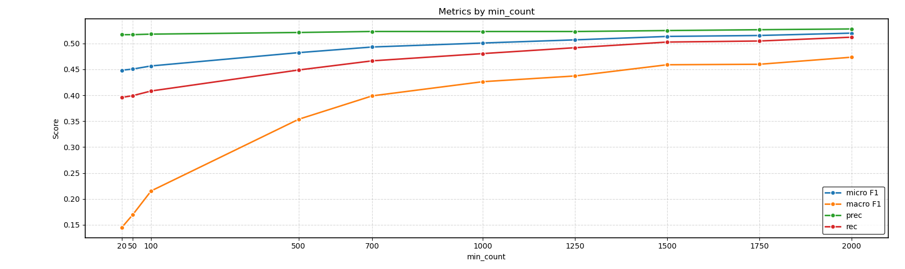

# Content-Based Movie Recommendation System

This project implements a content-based movie recommendation system using TF-IDF (Term Frequency-Inverse Document Frequency) for movie plot summaries and a One-vs-Rest Logistic Regression classifier for multi-label genre prediction. It includes a detailed pipeline from raw data processing to model evaluation and a basic movie recommendation functionality.

## Table of Contents
1.  [Project Overview](#project-overview)
2.  [Features](#features)
3.  [Setup and Installation](#setup-and-installation)
4.  [Data Sources](#data-sources)
5.  [Project Structure](#project-structure)
6.  [Execution Pipeline](#execution-pipeline)
7.  [Model Evaluation](#model-evaluation)
8.  [Movie Recommendation](#movie-recommendation)
9.  [Important Note on Code Changes and Generated Files](#important-note-on-code-changes-and-generated-files)
10. [Visualizations](#visualizations)

---

## 1. Project Overview

This project aims to build a system that can:
* Process raw movie metadata and plot summaries.
* Extract meaningful features from text using TF-IDF.
* Classify movies into multiple genres using a machine learning model.
* Provide content-based movie recommendations by finding similar movies based on their plot summaries.

A core aspect of this project is the investigation of how filtering less frequent genres impacts model performance, specifically for multi-label classification.

## 2. Features

* **Text Preprocessing:** Tokenization, lowercasing, punctuation/number removal, stop word filtering, and lemmatization.
* **Data Loading & Caching:** Efficient loading and caching of movie metadata and plot summaries using `.pkl` files.
* **Data Filtering:**
    * Exclusion of short plot summaries (configurable minimum token length).
    * Exclusion of specific "noisy" or less relevant genres (e.g., "World cinema", "Short Film").
* **Vocabulary Generation:** Creation of a unique, sorted vocabulary from filtered summaries.
* **TF-IDF Feature Extraction:** Calculation of TF-IDF vectors for each movie summary, stored efficiently as a sparse matrix (`.npz`).
* **Multi-Label Genre Classification:**
    * Uses `MultiLabelBinarizer` to handle multiple genres per movie.
    * Employs a `OneVsRestClassifier` with `LogisticRegression` as the base estimator.
* **Multi-Threshold Model Evaluation:** Comprehensive evaluation of the classification model's performance (Micro F1, Macro F1, Precision, Recall) across various minimum genre frequency thresholds. This helps analyze the impact of rare genres on model performance.
* **Content-Based Recommendation:** Recommends similar movies based on cosine similarity of their TF-IDF vectors.
* **Evaluation Result Export:** Saves detailed model evaluation results to a JSON file (`model_evaluation_results.json`).
* **Visualization of Results:** Generates plots to visualize model performance trends across different genre frequency thresholds.

## 3. Setup and Installation

1.  **Clone the repository:**
    ```bash
    git clone <your-repository-url>
    cd <your-project-directory>
    ```
2.  **Create and activate a virtual environment (recommended):**
    ```bash
    python -m venv venv
    # On Windows:
    .\venv\Scripts\activate
    # On macOS/Linux:
    source venv/bin/activate
    ```
3.  **Install required Python packages:**
    ```bash
    pip install -r requirements.txt
    ```
    (You will need to create a `requirements.txt` file if you don't have one, by running `pip freeze > requirements.txt`)
4.  **Download NLTK data:** The script will automatically attempt to download necessary NLTK data (stopwords, wordnet, averaged_perceptron_tagger). Ensure you have an active internet connection on the first run.

## 4. Data Sources

This project expects the following raw data files in a `raw/` subdirectory:

* `movie.metadata.tsv`: Contains movie IDs, titles, and genre information.
* `plot_summaries.txt`: Contains movie IDs and their corresponding plot summaries.

## 5. Project Structure

* `main.py` (or the name of your primary script): Contains the full pipeline for data loading, preprocessing, feature extraction, model training, evaluation, and recommendation.
* `vizualization.py` (if separate): Script for generating plots from `model_evaluation_results.json`.
* `raw/`: Directory to store input TSV and TXT files.
* **Generated Files:** The script generates several intermediate `.pkl` and `.npz` files for faster subsequent runs, along with `model_evaluation_results.json` for analysis.

## 6. Execution Pipeline

The `main.py` script executes the following steps sequentially:

1.  **Movie Metadata Loading/Creation:** Loads or creates `movie_metadata.pkl` from `movie.metadata.tsv`.
2.  **Summary List Creation:** Loads or creates `summaries.pkl` from `plot_summaries.txt` and `movie_metadata`, performing initial tokenization and basic cleaning.
3.  **Filtering Short Summaries:** Removes summaries below `MIN_SUMMARY_TOKENS` (default 100). Saves `summaries_length_filtered.pkl`.
4.  **Filtering Summaries by Genre:** Removes movies containing only specified `EXCLUDED_GENRES`. Saves `summaries_final.pkl`.
5.  **Vocabulary Creation:** Generates a unique vocabulary from the final filtered summaries. Saves `vocabulary_filtered.pkl`.
6.  **Inverse Document Frequency (IDF) Calculation:** Calculates IDF values for each word in the vocabulary. Saves `idf_dict.pkl` and `idf_dict.json`.
7.  **TF-IDF Sparse Matrix Creation:** Converts movie summaries into TF-IDF vectors, stored as a sparse matrix (`tf_idf_sparse_matrix.npz`).
8.  **Multi-Threshold Model Evaluation:**
    * Iterates through predefined `MIN_GENRE_FREQUENCY` thresholds.
    * For each threshold:
        * Filters genres based on frequency.
        * Prepares labels using `MultiLabelBinarizer`.
        * Splits data into training and testing sets.
        * Trains a `OneVsRestClassifier` with `LogisticRegression`.
        * Evaluates the model using Micro F1, Macro F1, Micro Precision, and Micro Recall.
        * Stores results in a list.
9.  **Export Results:** Saves all evaluation results to `model_evaluation_results.json`.
10. **Content-Based Recommendation:** Demonstrates a movie recommendation based on cosine similarity using the generated TF-IDF matrix.

## 7. Model Evaluation

The script performs a detailed model evaluation by varying the `MIN_GENRE_FREQUENCY` threshold. This analysis is crucial for understanding the trade-off between the number of genres considered and the overall model performance, especially regarding the impact of rare classes.

The `model_evaluation_results.json` file contains metrics (Micro F1, Macro F1, Micro Precision, Micro Recall) for each tested threshold.

## 8. Movie Recommendation

The `recommend_movies` function provides basic content-based recommendations. It identifies movies with similar plot summaries by computing the cosine similarity between their TF-IDF vectors. By default, it recommends 5 movies (excluding the query movie itself) that are most similar to the first movie in the filtered dataset (`movie_idx=0`). You can adjust `movie_idx` to get recommendations for other movies.

## 9. Important Note on Code Changes and Generated Files

This project saves several intermediate files (like `.pkl` and `.npz` files) to speed up execution and avoid re-processing large datasets.

**If you modify the code in a way that affects how these files are created or their content** (e.g., changes to tokenization logic, vocabulary creation, IDF calculation, or TF-IDF matrix generation, or summary filtering), **you must manually delete the affected files before running the code again.**

Otherwise, the script might load outdated data, leading to incorrect results or unexpected behavior.

**Files that might need to be deleted (depending on your code changes):**

* `movie_metadata.pkl`
* `summaries.pkl`
* `summaries_length_filtered.pkl`
* `summaries_final.pkl`
* `vocabulary_filtered.pkl`
* `idf_dict.pkl`
* `idf_dict.json`
* `tf_idf_sparse_matrix.npz`
* `model_evaluation_results.json`

Deleting these files ensures the script regenerates them with your latest changes, guaranteeing data consistency.

## 10. Visualizations

To visualize the results of the multi-threshold model evaluation, run the `vizualization.py` script. It will load data from `model_evaluation_results.json` and generate plots showing:

* **Model Metrics Across Different Genre Frequency Thresholds:** Displays Micro F1, Macro F1, Micro Precision, and Micro Recall as lines, illustrating their trends as the minimum genre frequency threshold increases.
* **Number of Genres Considered at Different Frequency Thresholds:** Shows how the number of included genres decreases with higher frequency thresholds, providing context for the performance metrics.

While working on the project and following the origional pipeline we proposed we were not seeing good results. So, we decided to look for other approaches
 which might provide better results. The main2.py file is the implementation of those different approaches.
# Methodology Deviations: Proposal vs Implementation Analysis

## Key Deviations from Original Proposal

### 1. Machine Learning Algorithm Change

| Aspect | Proposal | Implementation |
|--------|----------|----------------|
| Algorithm | Logistic Regression | Linear Support Vector Machine (LinearSVC) |
| Strategy | One-vs-Rest Logistic Regression | One-vs-Rest LinearSVC |

**Reasoning for Change:**

- **Better Performance**: SVM typically outperforms logistic regression on high-dimensional, sparse text data
- **Robustness**: LinearSVC is specifically optimized for text classification tasks
- **Class Imbalance**: The class_weight='balanced' parameter in SVM handles imbalanced genre distribution better than standard logistic regression
- **Scalability**: LinearSVC scales better with large vocabulary sizes common in NLP tasks
- **Research Evidence**: Literature shows SVM often achieves superior results for multi-label text classification

### 2. Feature Extraction Enhancement

| Aspect | Proposal | Implementation |
|--------|----------|----------------|
| Method | TF-IDF only | TF-IDF + Sentence Embeddings (dual approach) |
| Approach | Traditional bag-of-words | Modern transformer-based embeddings |

**Reasoning for Enhancement:**

- **Semantic Understanding**: Sentence embeddings capture semantic meaning beyond keyword matching
- **State-of-the-Art**: Transformer models (all-MiniLM-L6-v2) represent current best practices in NLP
- **Better Representations**: Dense embeddings often outperform sparse TF-IDF for similarity tasks
- **Flexibility**: Code allows switching between traditional and modern approaches
- **Future-Proofing**: The Embedding approach is more aligned with current NLP trends

### 3. Recommendation System Implementation

| Aspect | Proposal | Implementation |
|--------|----------|----------------|
| Method | Cosine Similarity on TF-IDF | Nearest Neighbors with Cosine Metric |
| Computation | Manual similarity computation | Scikit-learn's optimized NearestNeighbors |

**Reasoning for Change:**

- **Efficiency**: NearestNeighbors is highly optimized for similarity search
- **Scalability**: Better performance on large datasets
- **Flexibility**: Can easily change distance metrics or number of neighbors
- **Memory Efficiency**: Avoids computing the full pairwise similarity matrix
- **Industry Standard**: More commonly used in production recommendation systems

## Performance Analysis

### Metrics by Minimum Count Threshold



The graph above demonstrates the improvement in classification performance metrics as the minimum word frequency threshold increases. Key observations:

- **Precision (green)**: Maintains consistently high performance (~0.52) across all frequency thresholds, showing model stability
- **Micro F1 (blue)** and **Macro F1 (orange)**: Show steady improvement as minimum count increases, with micro F1 reaching ~0.52 and macro F1 reaching ~0.47 at higher thresholds
- **Recall (red)**: Demonstrates gradual improvement from ~0.39 to ~0.52 as frequency threshold increases
- **Optimal Performance**: All metrics converge around min_count=1500-2000, indicating that filtering low-frequency words significantly improves classification quality

This analysis supports our implementation choices by showing that careful feature selection (removing low-frequency terms) leads to better model performance across all evaluation metrics.